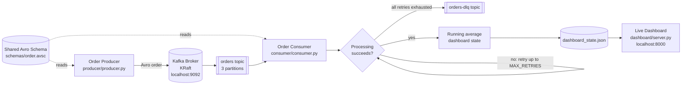
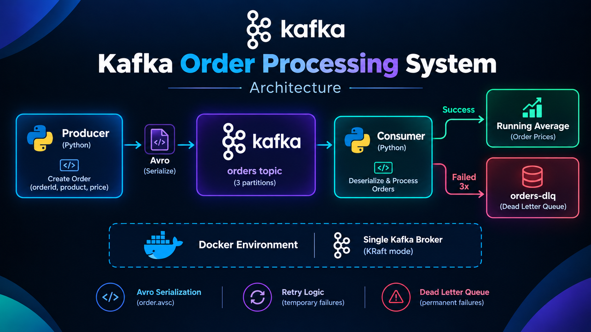

# Kafka Order Processing System

A small, end-to-end event-processing system built with Apache Kafka, Python,
and Avro. It generates orders, serializes them against a shared schema,
processes them with retry handling, routes permanently failed orders to a
dead-letter queue, and exposes live processing metrics through an optional
dashboard.

## Features

- Kafka 4.0.1 running in single-node KRaft mode, with no ZooKeeper dependency
- Avro serialization using one shared order schema
- Randomized order generation with configurable volume and send rate
- Consumer-side retry handling for transient processing failures
- Dead Letter Queue (DLQ) for orders that exhaust their retry attempts
- Manual offset commits after an order reaches a terminal processing path
- Running average price and order-processing metrics
- Optional zero-dependency live dashboard served on `http://localhost:8000`

## Architecture



### Visual Architecture Diagram



### Processing flow

1. The producer creates a randomized order and serializes it with
   `schemas/order.avsc`.
2. Kafka stores the Avro payload in the `orders` topic.
3. The consumer deserializes the order and attempts processing.
4. Transient failures are retried up to `MAX_RETRIES` times.
5. A successful order updates the running average. An order that still fails
   is serialized to the `orders-dlq` topic.
6. The consumer writes current metrics to `dashboard_state.json` and commits
   the Kafka offset after the order has been handled.

## Technology Stack

| Component           | Technology                          |
| ------------------- | ----------------------------------- |
| Messaging           | Apache Kafka 4.0.1                  |
| Kafka deployment    | Docker Compose, single-node KRaft   |
| Application runtime | Python 3.11+                        |
| Serialization       | Apache Avro via `fastavro`          |
| Kafka client        | `confluent-kafka`                   |
| Dashboard           | Python standard library HTTP server |

## Prerequisites

- Docker Desktop with Docker Compose
- Python 3.11 or newer
- A shell opened at the project root

## Quick Start

### 1. Start Kafka

```bash
docker compose up -d
```

The broker is exposed at `localhost:9092`. Allow approximately 20-30 seconds
for Kafka to finish starting before launching the applications.

### 2. Create a Python environment

Windows PowerShell:

```powershell
python -m venv .venv
.venv\Scripts\Activate.ps1
pip install -r requirements.txt
```

macOS or Linux:

```bash
python3 -m venv .venv
source .venv/bin/activate
pip install -r requirements.txt
```

### 3. Run the consumer and producer

Both scripts use the relative path `schemas/order.avsc`, so run them from the
project root.

Terminal 1, start the consumer first:

```bash
python consumer/consumer.py
```

Terminal 2, generate orders:

```bash
python producer/producer.py
```

The producer sends 20 orders at one-second intervals and then exits. The
consumer continues polling until stopped with `Ctrl+C`.

### 4. Open the live dashboard (optional)

In a third terminal, from the project root:

```bash
python dashboard/server.py
```

Open [http://localhost:8000](http://localhost:8000). The dashboard reads the
state written by the consumer and refreshes once per second. It can run
independently; the consumer does not require the dashboard to process orders.

## Configuration

The main runtime settings are defined near the top of the application files:

| Setting                   | File                                           |    Current value | Description                                                    |
| ------------------------- | ---------------------------------------------- | ---------------: | -------------------------------------------------------------- |
| `KAFKA_BOOTSTRAP_SERVERS` | `producer/producer.py`, `consumer/consumer.py` | `localhost:9092` | Kafka broker address                                           |
| `NUM_ORDERS`              | `producer/producer.py`                         |             `20` | Orders generated per run                                       |
| `SEND_INTERVAL_SECONDS`   | `producer/producer.py`                         |            `1.0` | Delay between produced orders                                  |
| `FAILURE_PROBABILITY`     | `consumer/consumer.py`                         |            `1.0` | Simulated processing-failure probability in the current source |
| `MAX_RETRIES`             | `consumer/consumer.py`                         |              `3` | Attempts before routing to the DLQ                             |
| `RETRY_DELAY`             | `consumer/consumer.py`                         |      `2` seconds | Delay between retry attempts                                   |

For a mixed success/failure demonstration, set `FAILURE_PROBABILITY` to `0.30`.
For a guaranteed DLQ demonstration, leave it at `1.0`; every order will be
retried and then published to `orders-dlq`.

## Order Schema

The producer and consumer both load [`schemas/order.avsc`](schemas/order.avsc),
which keeps the message contract in one place.

| Field     | Avro type | Description                    |
| --------- | --------- | ------------------------------ |
| `orderId` | `string`  | Generated order identifier     |
| `product` | `string`  | Randomly selected product name |
| `price`   | `float`   | Randomized product price       |

## Observability and Verification

Inspect records published to the DLQ:

```bash
docker exec -it kafka /opt/kafka/bin/kafka-console-consumer.sh \
  --bootstrap-server localhost:9092 \
  --topic orders-dlq \
  --from-beginning \
  --timeout-ms 5000
```

Inspect the consumer group's committed offsets:

```bash
docker exec -it kafka /opt/kafka/bin/kafka-consumer-groups.sh \
  --bootstrap-server localhost:9092 \
  --describe \
  --group order-consumer-group
```

The consumer also prints each order's partition, offset, retry attempts, and
processing result. The optional dashboard displays processed-order count,
running average price, DLQ count, recent orders, and average-price history.

## Project Structure

```text
kafka-order-system/
├── Architecture.png          # Visual system architecture diagram
├── docker-compose.yml       # Single-node Kafka broker in KRaft mode
├── requirements.txt         # Python dependencies
├── dashboard_state.json     # Runtime metrics written by the consumer
├── schemas/
│   └── order.avsc            # Shared Avro order schema
├── producer/
│   └── producer.py           # Generates and publishes orders
├── consumer/
│   └── consumer.py           # Consumes, retries, aggregates, and DLQs orders
└── dashboard/
    └── server.py             # Optional live dashboard server
```

## Reset the Environment

To remove the Kafka container, topics, and persisted broker data before a
clean run:

```bash
docker compose down -v
docker compose up -d
```

The dashboard state file is rewritten as the consumer processes new messages.
Delete `dashboard_state.json` manually if you also want to clear the last
displayed dashboard metrics before restarting the consumer.

## Troubleshooting

- **Connection refused:** confirm Docker is running and wait for Kafka to
  finish starting before launching Python processes.
- **Schema file not found:** run the producer and consumer from the project
  root, not from inside their individual directories.
- **No dashboard updates:** start `dashboard/server.py` from the project root
  and confirm that `consumer/consumer.py` is running and writing state.
- **Stale messages or offsets:** run the reset commands above, then restart
  the consumer before the producer.
